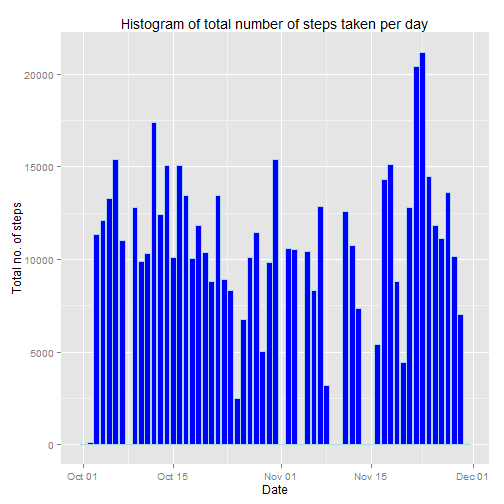
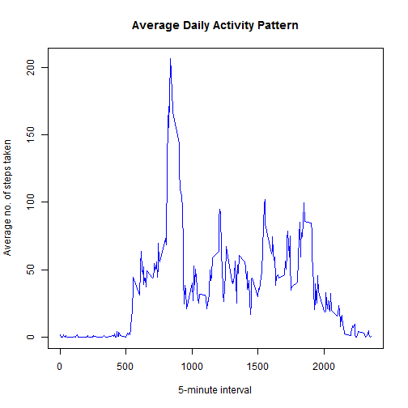
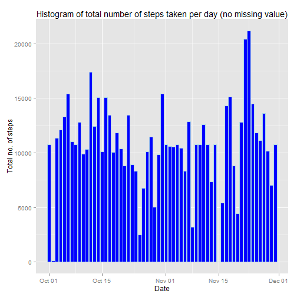
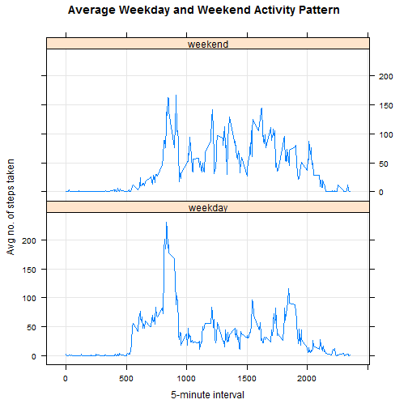

#Loading and preprocessing the data

```r
##Import required library
library(dplyr)
```

```
## 
## Attaching package: 'dplyr'
## 
## The following objects are masked from 'package:stats':
## 
##     filter, lag
## 
## The following objects are masked from 'package:base':
## 
##     intersect, setdiff, setequal, union
```

```r
library(ggplot2)
library(broman)
library(chron)
library(lattice)

data <- read.csv("./repdata_data_activity/activity.csv")
data_df <- tbl_df(data)
data_df$date <- as.Date(data_df$date, "%Y-%m-%d")
data_df_day <- group_by(data_df, date)
```

#What is mean total number of steps taken per day?

```r
steps_per_day <- summarise(data_df_day, steps = sum(steps, na.rm = TRUE))

##Plot histogram
ggplot(steps_per_day, aes(x = date, y=steps)) + 
    geom_bar(stat="identity", colour = "lightblue", fill = "blue") +
    xlab("Date") + ylab("Total no. of steps") + 
    labs(title = "Histogram of total number of steps taken per day")
```

 

```r
##Mean total no. of steps taken per day
mean_steps <- mean(steps_per_day$steps)
mean_steps <- myround(mean_steps, 2)

##Median total no. of steps taken per day
median_steps <- median(steps_per_day$steps)
```
The mean and median total number of steps taken per day is 9354.23 and 10395 respectively.

#What is the average daily activity pattern?

```r
data_df_interval <- group_by(data_df, interval)
steps_per_interval <- summarise(data_df_interval, avg_steps = mean(steps, na.rm = TRUE))

plot(steps_per_interval, type = "l", col = "blue",
     main = "Average Daily Activity Pattern",
     ylab = "Average no. of steps taken", 
     xlab = "5-minute interval")
```

 

```r
##5-min interval with most steps taken
steps_per_interval <- arrange(steps_per_interval, avg_steps)
max_interval <- steps_per_interval[nrow(steps_per_interval),1]
```
The 5-minute interval with maximum number of steps is interval 835.

#Imputing missing values?

```r
##Compute total no. of missing value
missing_values <- sum(is.na(data_df$steps))
```
The total number of missing values in the dataset is 2304. The strategy is to replace missing values with the mean of corresponding 5-minute interval.


```r
steps_per_interval_increasing <- arrange(steps_per_interval, interval)

data_df_No.NA <- data_df

##Function to fill up NA values
match_NA <- function(x, y){
    
    a <- nrow(x)
    b <- nrow(y)
    
    for (i in 1:a){
        if(is.na(x[i,1])){
            for (j in 1:b){
                if(x[i,3] == y[j,1]){
                    x[i,1] <- y[j,2]
                    break
                }
            }
        }
    }
    
    return (x)
}

##Call function match_NA
data_df_No.NA <- match_NA(data_df_No.NA, steps_per_interval_increasing)

data_df_No.NA_day <- group_by(data_df_No.NA, date)

steps_No.NA_per_day <- summarise(data_df_No.NA_day, steps = sum(steps, na.rm = TRUE))

##Plot histogram with no missing value
ggplot(steps_No.NA_per_day, aes(x = date, y=steps)) + 
    geom_bar(stat="identity", colour = "lightblue", fill = "blue") +
    xlab("Date") + ylab("Total no. of steps") + 
    labs(title = "Histogram of total number of steps taken per day (no missing value)")
```

 

```r
##Mean total no. of steps taken per day
mean_steps_No.NA <- mean(steps_No.NA_per_day$steps)
mean_steps_No.NA <- myround(mean_steps_No.NA, 2)

##Median total no. of steps taken per day
median_steps_No.NA <- median(steps_No.NA_per_day$steps)
median_steps_No.NA <- myround(median_steps_No.NA, 2)
```
The mean and median total number of steps taken per day is 10766.19 and 10766.19 respectively. Yes,  these values differ from the  estimates from the first part of the assignment. Imputing missing data causes the mean and median to be identical.

#Are there differences in activity patterns between weekdays and weekends?

```r
##1.Create a new factor variable in the dataset with two levels – “weekday” and “weekend” 
data_df_No.NA <- mutate(data_df_No.NA, Day = is.weekend(date))

wkday_wkend <- function(x){
    
    a <- nrow(x)    
    
    for(i in 1:a){
        if (x[i,4] == FALSE){
            x[i,4] <- "weekday";
        }else{
            x[i,4] <- "weekend";
        }
    }
    
    return(x)
}

data_df_No.NA <- wkday_wkend(data_df_No.NA)

data_df_No.NA$Day <- as.factor(data_df_No.NA$Day)

##Make a panel plot using factor variable (“weekday” and “weekend")
data_df_No.NA_Day_interval <- group_by(data_df_No.NA, Day, interval)

steps_per_Day_interval <- summarise(data_df_No.NA_Day_interval, avg_steps = mean(steps, na.rm = TRUE))

attach(steps_per_Day_interval)
xyplot(avg_steps~interval|Day,
       grid = TRUE, 
       type = "l",
       layout=c(1,2),
       main = "Average Weekday and Weekend Activity Pattern",
       ylab = "Avg no. of steps taken", 
       xlab = "5-minute interval")
```

 
Yes, there are differences in activity patterns between weekdays and weekends.
